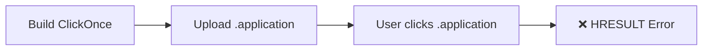
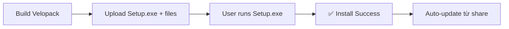

# Migration từ ClickOnce sang Velopack

## Vấn đề với ClickOnce

### Lỗi gặp phải:
```
HRESULT: 0x80070C81
Exception reading manifest from file://...
Parsing and DOM creation of the manifest resulted in error
```

### Nguyên nhân:
- **ClickOnce chỉ hỗ trợ .NET Framework 4.x** (WPF/WinForms legacy)
- **KHÔNG tương thích** với:
  - .NET 5, 6, 7, 8, 9, 10+
  - Avalonia UI
  - Cross-platform applications

### Tại sao?
ClickOnce được thiết kế cho .NET Framework cũ và sử dụng manifest format không tương thích với .NET modern.

---

## Giải pháp: Velopack

**Velopack** là công cụ thay thế ClickOnce, được thiết kế cho .NET modern apps:

### So sánh tính năng:

| Tính năng | ClickOnce (.NET FX) | Velopack (.NET modern) |
|-----------|---------------------|------------------------|
| Tương thích .NET 10 | ❌ Không | ✅ Có |
| Avalonia support | ❌ Không | ✅ Có |
| Auto-update | ✅ Có | ✅ Có |
| Delta updates | ❌ Không | ✅ Có |
| Network share | ⚠️ Có vấn đề | ✅ Hoạt động tốt |
| Web deployment | ✅ Có | ✅ Có |
| Không cần admin | ✅ Có | ✅ Có |
| Code signing | Optional | Optional |

---

## Hướng dẫn Migration

### Bước 1: Xóa ClickOnce config (Đã làm)

File `.csproj` **TRƯỚC** (không hoạt động):
```xml
<!-- ClickOnce Publishing Properties - KHÔNG DÙNG -->
<PublishUrl>publish\</PublishUrl>
<ApplicationRevision>0</ApplicationRevision>
<ApplicationVersion>1.0.4.0</ApplicationVersion>
<!-- ... các properties ClickOnce khác -->
```

File `.csproj` **SAU** (đã clean):
```xml
<!-- Assembly Information -->
<AssemblyVersion>1.0.4</AssemblyVersion>
<FileVersion>1.0.4</FileVersion>
<Version>1.0.4</Version>
<!-- Không còn ClickOnce properties -->
```

### Bước 2: Cài Velopack CLI

```powershell
dotnet tool install --global vpk
```

Verify:
```powershell
vpk --version
# Output: 0.0.1298 (hoặc mới hơn)
```

### Bước 3: Build với Velopack

```powershell
# Build installer
.\build\build-squirrel.ps1 -Version "1.0.4"
```

Output files:
```
dist/velopack/
├── VbdlisTools-1.0.4-win-Setup.exe    <- Installer cho users
├── VbdlisTools-1.0.4-win-full.nupkg   <- Package file
└── RELEASES                            <- Manifest cho auto-update
```

### Bước 4: Deploy lên Network Share

**TRƯỚC (ClickOnce - KHÔNG hoạt động):**
```powershell
# ClickOnce files
\\server\Setups\clickonce\
├── Haihv.Vbdlis.Tools.Desktop.application  <- KHÔNG hoạt động với .NET 10
├── Haihv.Vbdlis.Tools.Desktop.exe.manifest
└── ... other files
```

**SAU (Velopack - Hoạt động):**
```powershell
# Copy Velopack files
Copy-Item -Path "dist\velopack\*" -Destination "\\server\Setups\vbdlis-tools" -Recurse

# Structure:
\\server\Setups\vbdlis-tools\
├── VbdlisTools-1.0.4-win-Setup.exe    <- Users click này
├── VbdlisTools-1.0.4-win-full.nupkg
└── RELEASES
```

### Bước 5: Hướng dẫn Users

**Cài đặt lần đầu:**
1. Mở `\\server\Setups\vbdlis-tools\VbdlisTools-1.0.4-win-Setup.exe`
2. Click "Install"
3. Ứng dụng cài vào `%LOCALAPPDATA%\VbdlisTools\`

**So sánh:**

| Khía cạnh | ClickOnce (cũ) | Velopack (mới) |
|-----------|----------------|----------------|
| File click | `.application` | `-Setup.exe` |
| Kết quả | ❌ Lỗi HRESULT | ✅ Cài đặt OK |
| Vị trí cài | `%LOCALAPPDATA%\Apps\2.0\` (random) | `%LOCALAPPDATA%\VbdlisTools\` (predictable) |
| Uninstall | Settings > Apps | Settings > Apps |

---

## Auto-Update Migration

### ClickOnce code (KHÔNG dùng):
```csharp
// ❌ KHÔNG hoạt động với .NET 10
using System.Deployment.Application;

if (ApplicationDeployment.IsNetworkDeployed)
{
    var ad = ApplicationDeployment.CurrentDeployment;
    var info = ad.CheckForUpdate();
    // ...
}
```

### Velopack code (Dùng):
```csharp
// ✅ Hoạt động với .NET 10 + Avalonia
using Velopack;

public async Task CheckForUpdates()
{
    var updateUrl = @"\\server\Setups\vbdlis-tools";
    var mgr = new UpdateManager(updateUrl);
    var newVersion = await mgr.CheckForUpdatesAsync();

    if (newVersion != null)
    {
        await mgr.DownloadUpdatesAsync(newVersion);
        mgr.ApplyUpdatesAndRestart(newVersion);
    }
}
```

### Thêm Velopack package:
```powershell
cd src/Haihv.Vbdlis.Tools/Haihv.Vbdlis.Tools.Desktop
dotnet add package Velopack
```

---

## Deployment Workflow So sánh

### ClickOnce (Cũ - KHÔNG hoạt động):



### Velopack (Mới - Hoạt động):



---

## Update Workflow

### Version 1.0.4 → 1.0.5:

```powershell
# 1. Build version mới
.\build\build-squirrel.ps1 -Version "1.0.5"

# 2. Copy files mới lên network share (ghi đè)
Copy-Item -Path "dist\velopack\*" `
          -Destination "\\server\Setups\vbdlis-tools" `
          -Recurse -Force

# 3. Người dùng tự động nhận update khi mở app
```

**Delta updates:**
- Velopack tự động tạo delta packages
- Users chỉ tải phần thay đổi (~5-20MB thay vì ~100MB)
- Nhanh và tiết kiệm bandwidth

---

## Checklist Migration

### ✅ Đã hoàn thành:

- [x] Xóa ClickOnce properties khỏi .csproj
- [x] Cài Velopack CLI (`dotnet tool install --global vpk`)
- [x] Tạo build script Velopack (`build/build-squirrel.ps1`)
- [x] Update tài liệu BUILD_DEPLOY.md
- [x] Tạo QUICKSTART_VELOPACK.md

### 📋 Cần làm thêm:

- [ ] Build installer với Velopack
  ```powershell
  .\build\build-squirrel.ps1 -Version "1.0.4"
  ```

- [ ] Test installer trên máy clean
  ```powershell
  .\dist\velopack\VbdlisTools-1.0.4-win-Setup.exe
  ```

- [ ] Deploy lên network share
  ```powershell
  Copy-Item "dist\velopack\*" "\\server\Setups\vbdlis-tools" -Recurse
  ```

- [ ] Thêm Velopack package vào project (nếu muốn auto-update)
  ```powershell
  dotnet add package Velopack
  ```

- [ ] Thêm update code vào App.axaml.cs
  - Xem QUICKSTART_VELOPACK.md phần "Bước 4"

- [ ] Test auto-update
  - Build version mới (1.0.5)
  - Copy lên share
  - Verify app tự update

---

## Troubleshooting

### Vẫn gặp lỗi ClickOnce HRESULT?

**Nguyên nhân:** Đang chạy file `.application` cũ từ ClickOnce

**Giải pháp:**
1. Xóa folder ClickOnce cũ:
   ```powershell
   Remove-Item "dist\clickonce" -Recurse -Force
   Remove-Item "\\server\Setups\clickonce" -Recurse -Force
   ```

2. Uninstall ClickOnce app cũ (nếu đã cài):
   ```powershell
   # Settings > Apps > VBDLIS Tools > Uninstall
   ```

3. Dùng Velopack installer mới:
   ```powershell
   \\server\Setups\vbdlis-tools\VbdlisTools-1.0.4-win-Setup.exe
   ```

### Build Velopack failed?

```powershell
# Check vpk installed
vpk --version

# Reinstall nếu cần
dotnet tool uninstall --global vpk
dotnet tool install --global vpk

# Rebuild
.\build\build-squirrel.ps1
```

### Users không thấy update?

1. Check UpdateUrl trong code
2. Verify RELEASES file tồn tại trên share
3. Check permissions (users cần read access)
4. Check version number (phải > version hiện tại)

---

## Benefits Summary

### Tại sao Velopack tốt hơn ClickOnce:

1. **✅ Tương thích .NET 10**
   - ClickOnce: ❌ Chỉ .NET Framework 4.x
   - Velopack: ✅ .NET 5, 6, 7, 8, 9, 10+

2. **✅ Delta Updates**
   - ClickOnce: ❌ Full download mỗi lần
   - Velopack: ✅ Chỉ tải phần thay đổi

3. **✅ Network Share Support**
   - ClickOnce: ⚠️ Có vấn đề với manifest
   - Velopack: ✅ Hoạt động hoàn hảo

4. **✅ Modern & Maintained**
   - ClickOnce: ⚠️ Legacy, không update
   - Velopack: ✅ Active development

5. **✅ Better UX**
   - ClickOnce: Random path, confusing dialogs
   - Velopack: Predictable path, clean UI

---

## Next Steps

1. **Build installer:**
   ```powershell
   .\build\build-squirrel.ps1
   ```

2. **Test local:**
   ```powershell
   .\dist\velopack\VbdlisTools-1.0.4-win-Setup.exe
   ```

3. **Deploy to network:**
   ```powershell
   Copy-Item "dist\velopack\*" "\\server\Setups\vbdlis-tools" -Recurse
   ```

4. **Add auto-update** (optional):
   - Xem [QUICKSTART_VELOPACK.md](QUICKSTART_VELOPACK.md)

5. **Document for users:**
   - Link cài đặt: `\\server\Setups\vbdlis-tools\VbdlisTools-1.0.4-win-Setup.exe`
   - Auto-update: Tự động khi mở app

---

## References

- **Velopack Docs:** https://docs.velopack.io/
- **Build Script:** [build/build-squirrel.ps1](build/build-squirrel.ps1)
- **Quick Start:** [QUICKSTART_VELOPACK.md](QUICKSTART_VELOPACK.md)
- **Full Docs:** [BUILD_DEPLOY.md](BUILD_DEPLOY.md)
- **Comparison:** [DEPLOYMENT_COMPARISON.md](DEPLOYMENT_COMPARISON.md)
